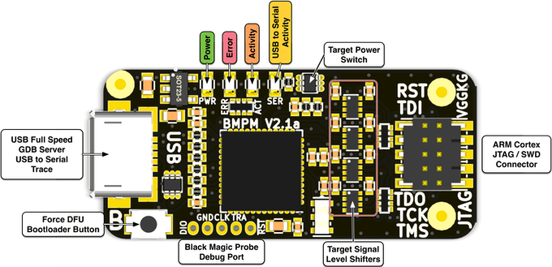
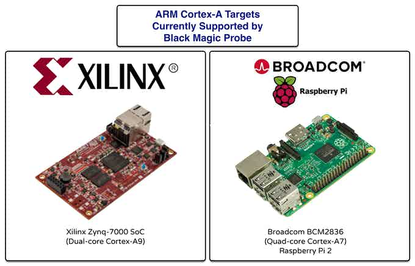
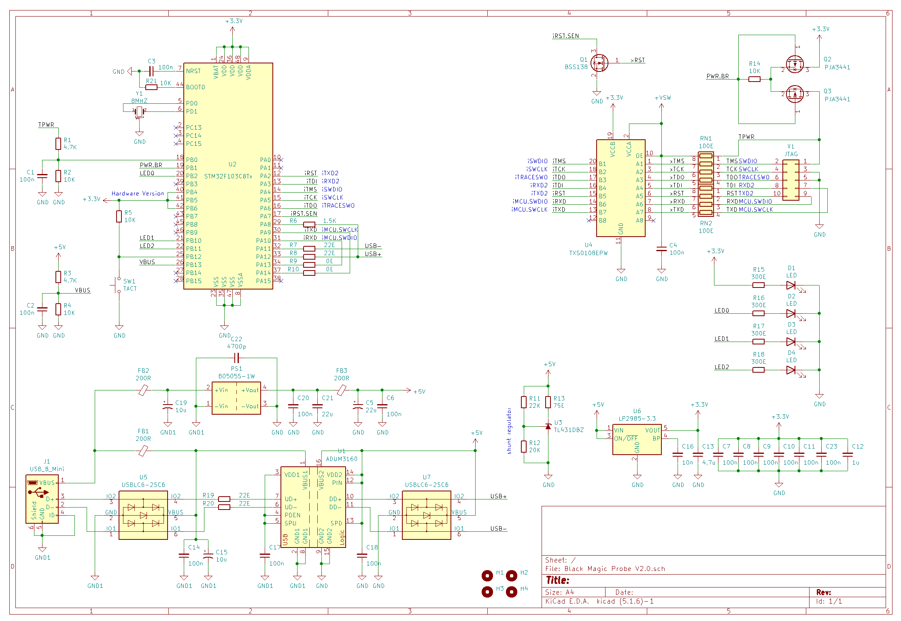
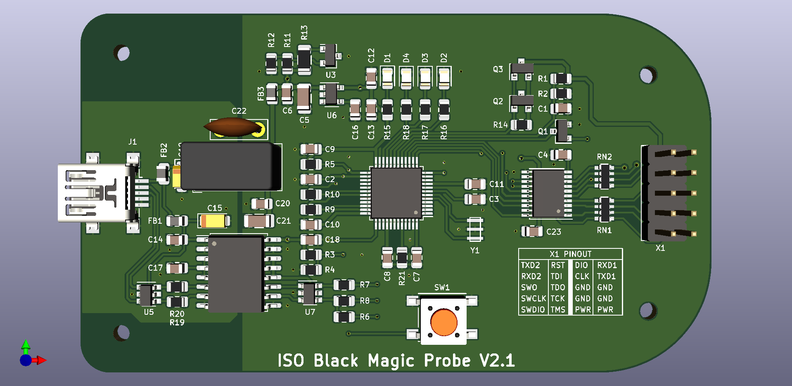

# ISO Black Magic Probe

**Black Magic Probe hardware features:**

*  On board implementation of JTAG (Joint Test Access Group) protocol
*  On board implementation of the SWD (Serial Wire Debug) protocol
*  High speed data interface to the Device Under Test 4.5MBit
*  On board implementation of the GNU Debugger Server protocol (no need for OpenOCD) works with stock arm-none-eabi-gdb (no patches or plugins needed)
*  Automatic detection of the Device Under Test (no need for config files)
*  Frontend Level shifter. Usable with targets that run on voltages as low as 1.7V and as high as 5V.
*  There is experimental support for Cortex-A (ARMv7-A architecture). This is being used with success on Xilinx Zynq-7000 SoC (Dual-core Cortex-A9) and Raspberry Pi 2 (Quad-core Cortex-A7).
*  Semihosting IO support (allows execution of print, read, open, system calls on the host through the JTAG/SWD interface)
*  Interface to the host computer is a standard USB CDC ACM device (virtual serial port), which does not require special drivers on Linux or MacOS.
*  Auxiliary UART interface. Black Magic Probe can be used as a USB to Serial adapter at the same time together with the JTAG/SWD interface.
*  Implements USB DFU class for easy firmware upgrade as updates become available.
*  Works with Windows, Linux and MacOS environments.

